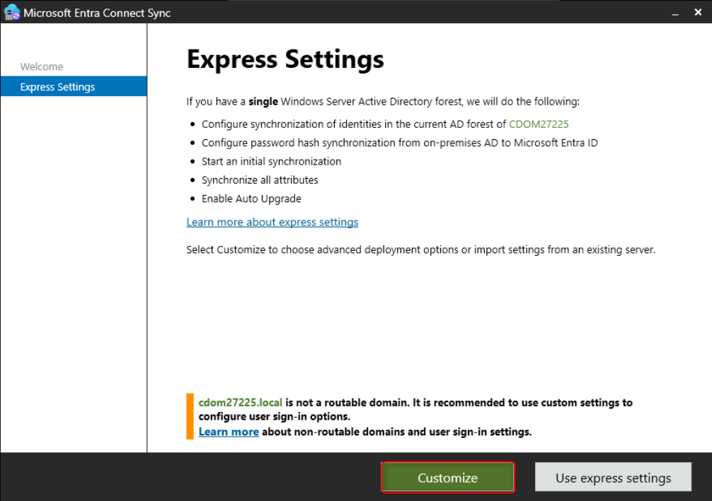
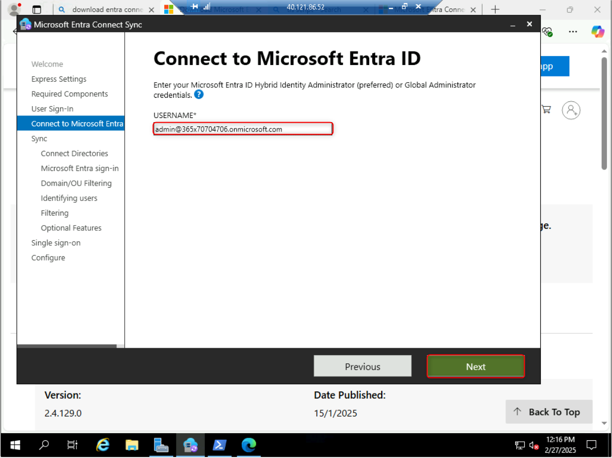
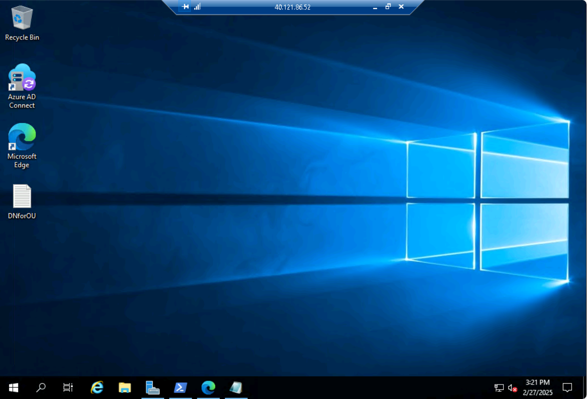
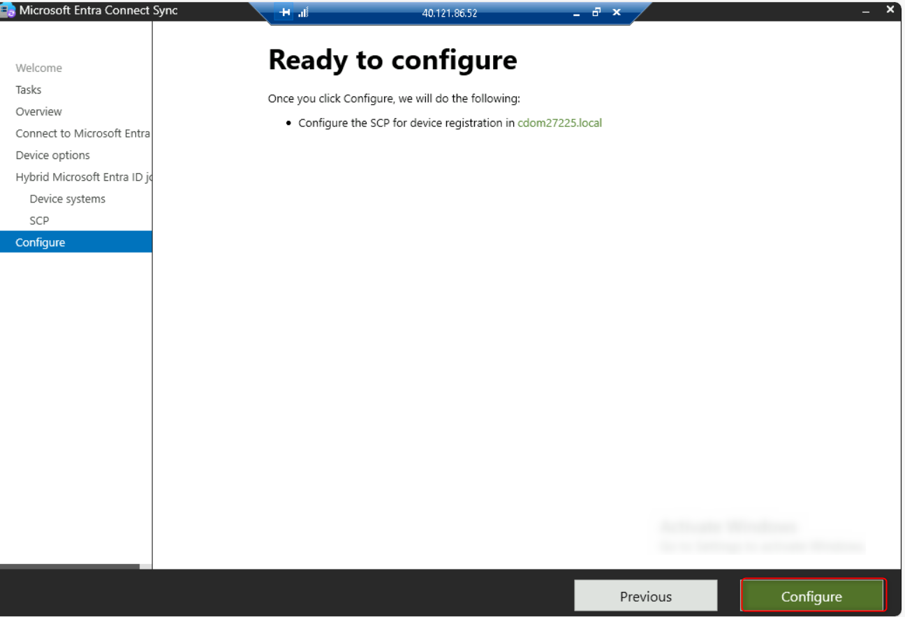

# Lab 1 - Preparing the Lab Environment

## Task 1 - Create a new Forest and Domain for On-Premises setup

1.  Open the Edge Browser and login to **Azure
    Portal** [**https://portal.azure.com**](urn:gd:lg:a:send-vm-keys) using
    the Office 365 Tenant credentials from the home tab of Lab
    interface.

> 
>
> 

2.  Click on the **Portal Menu** then select **+ Create a resource**

> 

3.  In the search type [**template**](urn:gd:lg:a:send-vm-keys) and
    select **Template deployment**

4.  On the **Template deployment (deploy using custom templates)** page
    click on **Create**

5.  In the **Quickstart template** search **new-domain** and
    select **application-workloads/active-directory/active-directory-new-domain
    template**

6.  Click on **Select template**

7.  On the **Custom deployment** page provide the below details

a\. Subscription -- **Azure Pass -- Sponsorship**

b\. Resource group -- Create new
-- [**Rg4OnPremDC**](urn:gd:lg:a:send-vm-keys)

c\. Region -- **East US**

d\. Admin Username -- [**adminuser**](urn:gd:lg:a:send-vm-keys)

e\. Admin Password -- [**demo@pass123**](urn:gd:lg:a:send-vm-keys)

f\. Domain Name
-- [**cdomxxxxxx.local**](urn:gd:lg:a:send-vm-keys) \[substitute **xxxxxx** with
random number\]

g\. DNS prefix
- [**cdomxxxxxx**](urn:gd:lg:a:send-vm-keys) \[substitute **xxxxxx** with
random number as above\]

h\. Keep the remaining settings as default and then click on **Review +
create**

8.  Click on **Create** to start the deployment

9.  Wait for the deployment to complete, it will take around 12-15
    minutes to complete the deployment

10. Once the Deployment is competed click on **Go to resource group**

> 

11. It will open the Resource group page where all the resources have
    been created by the deployment

> 

## Task 2 -- Login to the Domain controller and create resources for testing

1.  From the **Rg4OnPremDC** Resource group page, click on
    the **adVM** virtual machine

> 

2.  On the **adVM** page click on Connect.

> 
>
> 

3.  Ensure to change the IP address to **Load balancer DNS name**, then
    click on **Download RDP file**

> 
>
> 

4.  Click on **Open file** to connect to the VM, when prompted enter the
    password demo@pass123

> 

5.  The Server Manager will be launched automatically, click
    on **Tools**, then select **Active Directory Users and Computers**

> 
>
> 

6.  We will create 2 Organizational Units (OUs)

> a. **Cloud PCs** -- **Required to the Azure Network connection for
> Hybrid Azure AD Join**
>
> b. **Cloud PC Users** -- Test accounts for testing Windows 365 Cloud
> PC

7.  **Right-click** on the Domain name then select **New**, then click
    on **Organizational Unit**

> 

8.  For the OU Name enter [**Cloud PCs**](urn:gd:lg:a:send-vm-keys) then
    click **OK**

> 

9.  **Right-click** on the Domain name then select **New**, then click
    on **Organizational Unit**

> 

10. For the OU Name enter **Cloud PC Users** then click **OK**

> 

11. Right-click on the newly create OU **Cloud PC Users**, then
    select **New** and then click on **User**

> 

12. On the **New Object -- User** window provide the below details

> a\. First name -- [**Test**](urn:gd:lg:a:send-vm-keys)
>
> b\. Last name -- [**User1**](urn:gd:lg:a:send-vm-keys)
>
> c\. User logon name -- [**testuser1**](urn:gd:lg:a:send-vm-keys)
>
> d\. Click on **Next**
>
> 

13. On the Password details provide the below details

> a\. Password -- [**demo@pass123**](urn:gd:lg:a:send-vm-keys)
>
> b\. Confirm password - [**demo@pass123**](urn:gd:lg:a:send-vm-keys)
>
> c\. Only select the checkbox for **Password never expire**
>
> d\. Click on **Next**

**Note** -- This Password never expire setting is only for Lab
environment, it is recommended to keep User must change password at next
logon.

14. Click on **Finish** to complete the User creation

> 

15. In the **Active Directory Users and Computers**, select
    the **View** menu and click on **Advanced features**

> 
>
> **Note** -- The Advanced features setting will enable us to see
> additional details for the all Objects in AD

16. Right-click on the **Cloud PCs** OU then select **Properties**

> 

17. Select the **Attribute Editor** tab, then open
    the **distinguishedName** attribute and copy the Value into
    a **Notepad** file as it would be required in Later.

> 

18. Save the information as **DNforOU.txt** on the Desktop

> 

## Task 3 -- Install Azure AD connect and setup PHS and Hybrid Azure AD Join

1.  Open Windows PowerShell (admin) and run the following script in the
    virtual machine

> If (-Not (Test-Path
> 'HKLM:\SOFTWARE\WOW6432Node\Microsoft\\NETFramework\v4.0.30319'))
>
> {
>
> New-Item
> 'HKLM:\SOFTWARE\WOW6432Node\Microsoft\\NETFramework\v4.0.30319' -Force
> | Out-Null
>
> }
>
> New-ItemProperty -Path
> 'HKLM:\SOFTWARE\WOW6432Node\Microsoft\\NETFramework\v4.0.30319' -Name
> 'SystemDefaultTlsVersions' -Value '1' -PropertyType 'DWord' -Force |
> Out-Null
>
> New-ItemProperty -Path
> 'HKLM:\SOFTWARE\WOW6432Node\Microsoft\\NETFramework\v4.0.30319' -Name
> 'SchUseStrongCrypto' -Value '1' -PropertyType 'DWord' -Force |
> Out-Null
>
> If (-Not (Test-Path
> 'HKLM:\SOFTWARE\Microsoft\\NETFramework\v4.0.30319'))
>
> {
>
> New-Item 'HKLM:\SOFTWARE\Microsoft\\NETFramework\v4.0.30319' -Force |
> Out-Null
>
> }
>
> New-ItemProperty -Path
> 'HKLM:\SOFTWARE\Microsoft\\NETFramework\v4.0.30319' -Name
> 'SystemDefaultTlsVersions' -Value '1' -PropertyType 'DWord' -Force |
> Out-Null
>
> New-ItemProperty -Path
> 'HKLM:\SOFTWARE\Microsoft\\NETFramework\v4.0.30319' -Name
> 'SchUseStrongCrypto' -Value '1' -PropertyType 'DWord' -Force |
> Out-Null
>
> If (-Not (Test-Path
> 'HKLM:\SYSTEM\CurrentControlSet\Control\SecurityProviders\SCHANNEL\Protocols\TLS
> 1.2\Server'))
>
> {
>
> New-Item
> 'HKLM:\SYSTEM\CurrentControlSet\Control\SecurityProviders\SCHANNEL\Protocols\TLS
> 1.2\Server' -Force | Out-Null
>
> }
>
> New-ItemProperty -Path
> 'HKLM:\SYSTEM\CurrentControlSet\Control\SecurityProviders\SCHANNEL\Protocols\TLS
> 1.2\Server' -Name 'Enabled' -Value '1' -PropertyType 'DWord' -Force |
> Out-Null
>
> New-ItemProperty -Path
> 'HKLM:\SYSTEM\CurrentControlSet\Control\SecurityProviders\SCHANNEL\Protocols\TLS
> 1.2\Server' -Name 'DisabledByDefault' -Value '0' -PropertyType 'DWord'
> -Force | Out-Null
>
> If (-Not (Test-Path
> 'HKLM:\SYSTEM\CurrentControlSet\Control\SecurityProviders\SCHANNEL\Protocols\TLS
> 1.2\Client'))
>
> {
>
> New-Item
> 'HKLM:\SYSTEM\CurrentControlSet\Control\SecurityProviders\SCHANNEL\Protocols\TLS
> 1.2\Client' -Force | Out-Null
>
> }
>
> New-ItemProperty -Path
> 'HKLM:\SYSTEM\CurrentControlSet\Control\SecurityProviders\SCHANNEL\Protocols\TLS
> 1.2\Client' -Name 'Enabled' -Value '1' -PropertyType 'DWord' -Force |
> Out-Null
>
> New-ItemProperty -Path
> 'HKLM:\SYSTEM\CurrentControlSet\Control\SecurityProviders\SCHANNEL\Protocols\TLS
> 1.2\Client' -Name 'DisabledByDefault' -Value '0' -PropertyType 'DWord'
> -Force | Out-Null
>
> Write-Host 'TLS 1.2 has been enabled. You must restart the Windows
> Server for the changes to take affect.' -ForegroundColor Cyan
>
> 
>
> 

2.  Open the browser on the **adVM** and download **Azure AD
    connect** from the
    link [**https://www.microsoft.com/en-ie/download/details.aspx?id=47594**](https://www.microsoft.com/en-ie/download/details.aspx?id=47594)

3.  Click **Download** and run the application.

> 

4.  Once installed, the AD Connect configuration will start. Enable the
    checkbox for **I agree to the license terms and privacy notice** and
    click **Continue**.

> 

5.  On the Express Settings page click **Customize**.

> 

6.  On the Install required components page click **Install**.

> 

7.  At the User sign-in page, choose **Password Hash
    Synchronization** as the Sign On method and enable the checkbox
    for **Enable single sign-on** then click on **Next**.

> 

8.  On the **Connect to Microsoft Entra ID** page, enter the **Office
    365 Tenant credentials** from the home tab of Lab interface.

> 
>
> 

9.  On the connect your directories page click **Add Directory**.

> 

10. On the **AD Forest account** window click Create new account and
    enter the following credentials and click OK:

    - Domain
      Username: [**CDOMxxxxxx\adminuser**](urn:gd:lg:a:send-vm-keys) \[xxxxxx
      will be as per the domain specified by you in task 1\]

    - Password: [**demo@pass123**](urn:gd:lg:a:send-vm-keys)

11. Click on **Next** once the CONFIGURED DIRECTORIES is populated.

> 

12. On the **Azure AD sign in configuration** page click **Continue
    without matching all UPN suffixes to verified domains** check box
    and click **Next**.

> 

13. On the **Domain and OU filtering** page click on **Sync selected
    domains and OUs**, then choose only **Cloud PC Users** and **Cloud
    PCs**, then click on **Next**.

> 

14. On the **Uniquely identifying your users** page click **Next**.

> 

15. On the **Filter users and devices** page click **Next**.

> 

16. On the **Optional features** page click **Next**.

> 

17. On the **Enable single sign-on** page, click on **Enter
    credentials**

> 

18. On the **Forest credentials** prompt enter the below credentials and
    click **OK**

    - Username -- [**adminuser**](urn:gd:lg:a:send-vm-keys)

    - Password -- [**demo@pass123**](urn:gd:lg:a:send-vm-keys)

> 

19. Click on **Next**

> 

20. On the **Ready to configure** page click **Install**. This process
    will take around 5-8 minutes to complete.

> 

21. Once the installation is complete click **Exit**.

> 

22. Launch the **Azure AD connect** from the Desktop Icon again.

> 

23. On the Welcome screen, click on Configure

> 

24. On the **Additional tasks** page, select **Configure device
    options** then click on **Next**

> 

25. On the **Overview** page click on **Next**

> 

26. On the **Connect to Microsoft Entra ID** page, enter the **Office
    365 Tenant credentials** from the home tab of Lab interface and
    click on **Next**

> 

27. On the **Device options** page, select **Configure Hybrid Microsoft
    Entra ID join** radio button and then click on **Next**

> 

28. On the **Device operating systems** page, enable both the checkboxes
    and then click on **Next**

> 

29. On the **SCP configuration** page, enable the check box for the
    Forest, then select **Microsoft Entra ID** then click on
    the **Add** button

> 

30. When prompted for Enterprise Admin Credentials, enter the below
    credentials and then click OK

    - Username -- [**adminuser**](urn:gd:lg:a:send-vm-keys)

    - Passwor\`d -- [**demo@pass123**](urn:gd:lg:a:send-vm-keys)

> 

31. Click on **Next**

> 

32. On the **Ready to configure** page click on the **Configure** button

> 

33. On the **Configuration complete** page, click on the link to review
    the article, then click on **Exit** button

> 
>
> End this Lab
