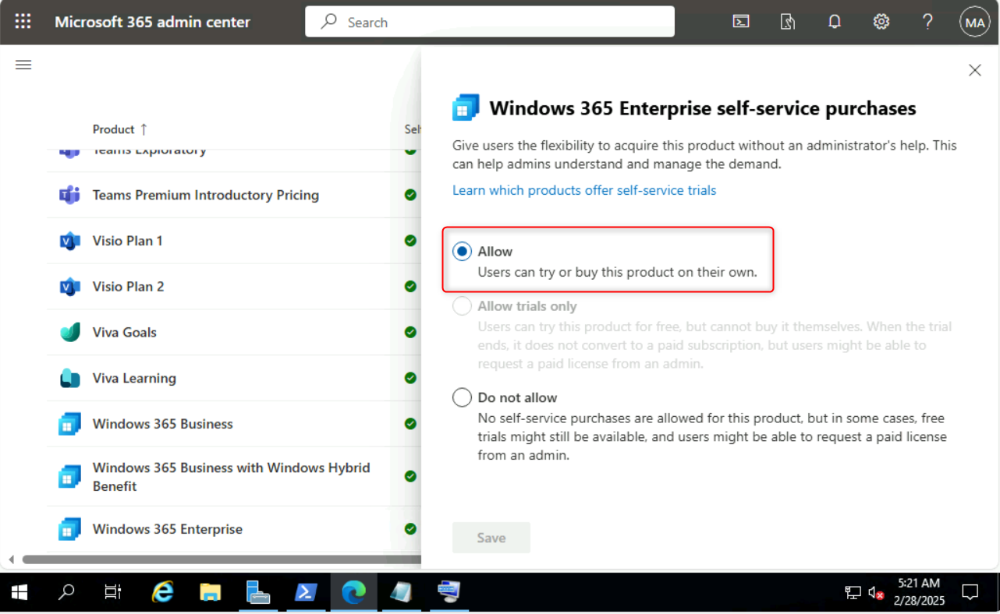
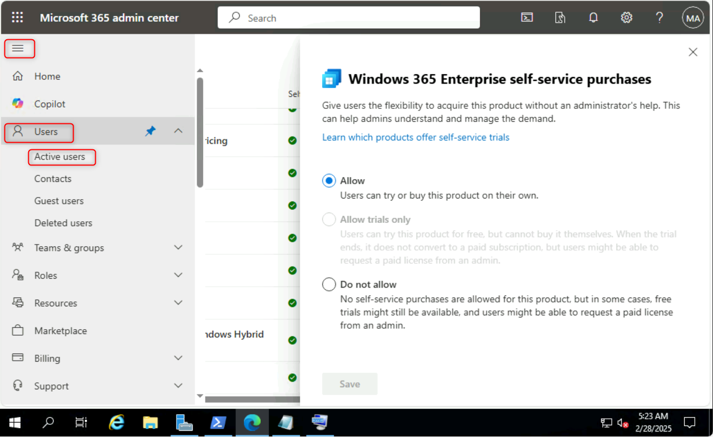
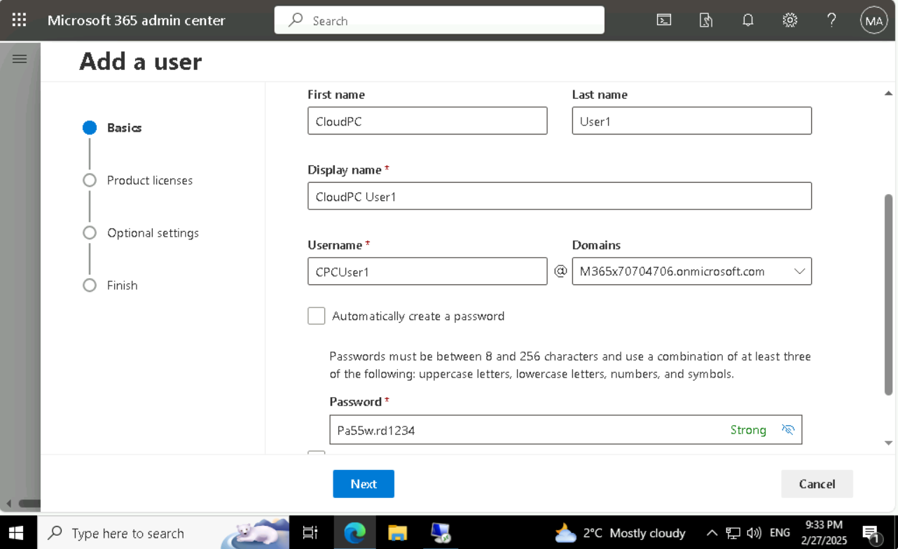
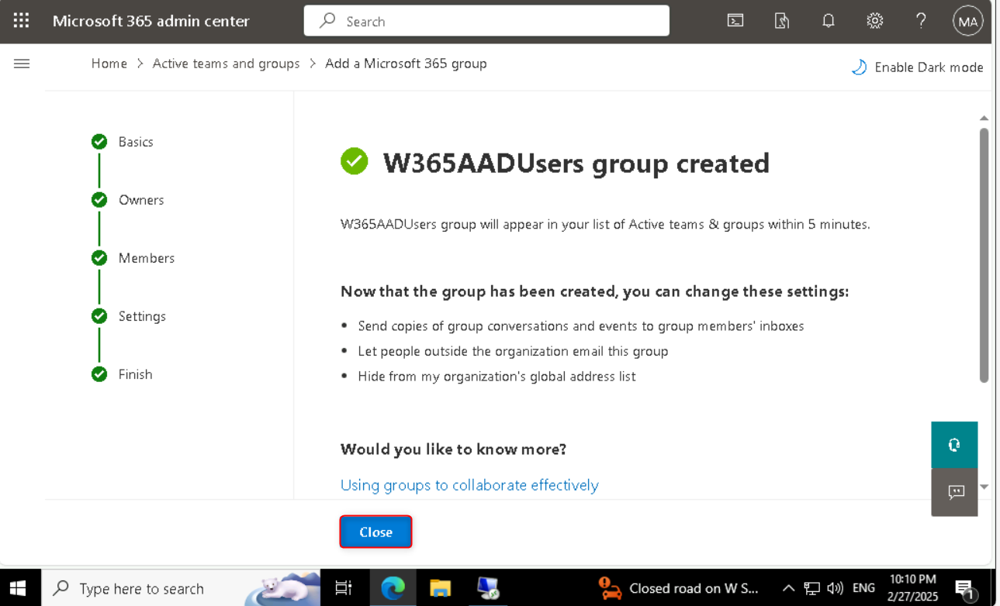

# Lab 2 - Acquiring the trial license for Windows 365 Enterprise

## Task 1 - Sign up for trial and create user for testing

1.  Open the Edge Browser and login to **Microsoft 365 admin
    center** [**https://admin.microsoft.com**](urn:gd:lg:a:send-vm-keys) using
    the Office 365 Tenant credentials from the home tab of Lab
    interface.

> 

2.  Once logged in **Microsoft 365 admin center**, expand **Settings \>
    Org settings**. From there, go to the **Services** tab and
    select **Self-service trials and purchases**

> 
>
> 

3.  From the section **Self-service trails and purchases,** click
    on **Windows 365** then click on **Details** under the **Windows 365
    Enterprise**

> 

4.  Ensure that the option to try or buy Windows 365 Enterprise is
    selected by default.

5.  While still in the **Microsoft 365 admin center**,
    expand **Users** and click on **Active Users**

> 

6.  You should be able to see the On-premises User which has been synced
    to Azure AD in the list as **Test User1**

> 

7.  Click on **Add a user**

> 

8.  On the Add user Basics tab provide the below details and click
    **Next**.

> a\. First name - [**CloudPC**](urn:gd:lg:a:send-vm-keys)
>
> b\. Last name - [**User1**](urn:gd:lg:a:send-vm-keys)
>
> c\. Display name - [**CloudPC User1**](urn:gd:lg:a:send-vm-keys)
>
> d\. Username - [**CPCUser1**](urn:gd:lg:a:send-vm-keys)
>
> e\. Uncheck all boxes and set password
> as [**Pa55w.rd1234**](urn:gd:lg:a:send-vm-keys)
>
> 

9.  On the **Product licenses** tab choose the **Office 365 E5** license
    and click on **Next**

> 

10. On the **Optional settings** tab, click on **Next.**

> 

11. On the **Review and finish** tab, review the details and then click
    on **Finish adding** button.

> 

12. Click on the **Close** button on the next screen

> 

## Task 2 - Create groups for Cloud PC users

1.  Expand **Teams & groups**, then select **Active teams and groups**,
    then click on **Add a group**

> 
>
> 

2.  On the **Set up the basics** page, provide the below details and
    click on **Next**

> a\. Name - [**W365AADUsers**](urn:gd:lg:a:send-vm-keys)
>
> b\. Description - [**Windows 365 Cloud PC Users -
> AAD**](urn:gd:lg:a:send-vm-keys)
>
> 

3.  On the **Assign owners** page select **MOD Administrator** and click
    on **Next**

> 
>
> 
>
> 

4.  On the **Add members** page click on **+ Add members** then
    select **CloudPC User1** and click **Add (1)** then click
    on **Next**

> 
>
> 
>
> 

5.  On the **Edit settings** page, provide the below details and click
    on **Next**

> a\. Group email address - [**w365AADusers**](urn:gd:lg:a:send-vm-keys)
>
> b. **Uncheck** Create a team for this group
>
> 

6.  On the **Review and finish adding group** page click on **Create
    group**.

> 

7.  On the next page click on the **Close** button

> 

8.  Repeat the same steps to create another group with below details

> a\. Name - [**W365OnpremUsers**](urn:gd:lg:a:send-vm-keys)
>
> b\. Description - [**Windows 365 Cloud PC Users -
> Onprem**](urn:gd:lg:a:send-vm-keys)
>
> c\. Members - [**Test User1**](urn:gd:lg:a:send-vm-keys)
>
> d\. Group email address
> - [**w365Onpremusers**](urn:gd:lg:a:send-vm-keys)
>
> 
>
> 

9.  You should be able to see the newly created groups listed as shown
    in below image

> 
